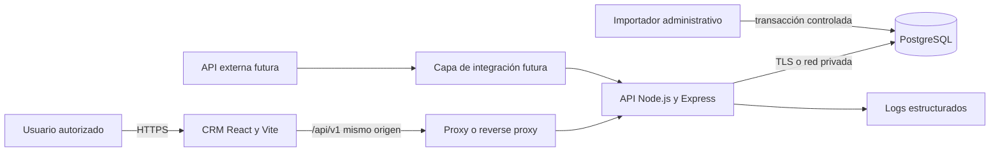
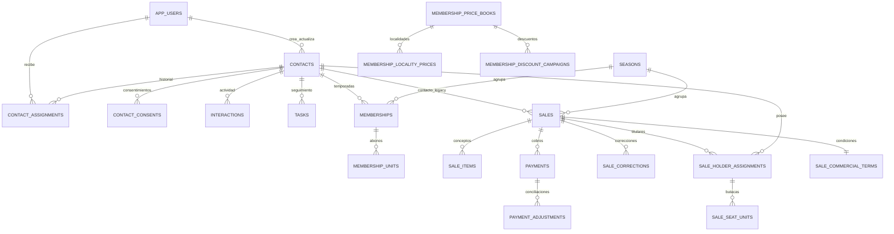
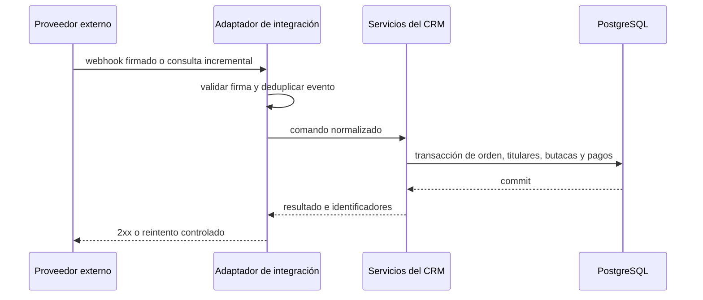

# Entrega técnica del CRM de Abonados

Actualizado: 1 de octubre de 2026  
Audiencia: equipo de Sistemas y proveedores autorizados de Charros de Jalisco  
Alcance: CRM privado de abonados LMP 2026–2027, su base PostgreSQL, migración a infraestructura institucional e integración futura con una API externa.

Este documento describe el estado implementado. El CRM funciona hoy como una aplicación web React separada de una API Node.js y una base PostgreSQL. La migración recomendada conserva esta separación, traslada primero PostgreSQL y la API, valida la integridad y finalmente cambia el frontend al nuevo host. La integración externa debe entrar por una capa de servicio autenticada; no debe escribir directamente en las tablas ni reutilizar la sesión del administrador del navegador.

## Estado actual y repositorios

| Elemento | Ubicación actual | Ruta o rama relevante |
| --- | --- | --- |
| Repositorio operativo | `https://github.com/carlosmorenocc/charros-jalisco-sistema-encuestas.git` | `feat/crm-abonados-lmp-26-27` |
| Repositorio institucional | `https://github.com/CharrosJalisco/CRM-abonados-prueba.git` | `main` |
| Frontend CRM | Vercel | raíz `crm-web` |
| API CRM | Render | raíz `crm-api` |
| Base de datos | PostgreSQL en Render | conexión privada desde la API |
| Importador controlado | ejecución administrativa | raíz `crm-import` |

El repositorio también contiene encuestas públicas. El CRM está aislado en `crm-web`, `crm-api` y `crm-import`; no utiliza los CSV de las encuestas como almacenamiento operativo.

## Arquitectura implementada



### Componentes

- `crm-web`: SPA React 18 compilada por Vite. Consume `/api/v1`, usa cookies first-party y no almacena tokens de sesión en `localStorage`.
- `crm-api`: Node.js 20 o superior, Express, `pg`, Helmet, CORS exacto, rate limiting, validación de entrada, permisos, auditoría y exportaciones.
- PostgreSQL: fuente persistente y transaccional. Requiere la extensión `pgcrypto` para UUID.
- `crm-import`: CLI separado para auditar e importar archivos históricos en staging. No forma parte del tráfico web normal.
- Migraciones: archivos numerados en `crm-api/migrations`. Se ejecutan en orden y sus SHA-256 quedan registrados en `schema_migrations`.

### Flujo de una operación

1. El navegador carga la SPA por HTTPS.
2. El proxy conserva `/api/v1` bajo el mismo dominio visible para el navegador.
3. La API valida sesión, origen y CSRF.
4. El servicio aplica permisos y reglas comerciales.
5. El repositorio ejecuta consultas parametrizadas y transacciones PostgreSQL.
6. Las mutaciones relevantes escriben un evento en `audit_events`.
7. La API devuelve JSON con `X-Request-ID`; las ediciones concurrentes usan `ETag` e `If-Match`.

## Directorios que debe conocer Sistemas

```text
crm-api/
  migrations/              esquema y evolución de PostgreSQL
  scripts/                 migración, bootstrap, reset y sincronización
  src/app.js               middleware HTTP y montaje de rutas
  src/routes.js            contrato REST del CRM
  src/services/            autorización y lógica de aplicación
  src/repositories/        consultas y transacciones PostgreSQL
  src/security/            autenticación, sesiones, contraseñas y permisos
  src/lib/validation.js    validación de payloads
  tests/                   pruebas del backend

crm-web/
  src/App.jsx              interfaz y módulos del CRM
  src/lib/apiClient.js     cliente HTTP
  vercel.json              proxy actual hacia Render y encabezados

crm-import/
  src/                     auditor e importador controlado
  tests/fixtures/          datos sintéticos de prueba

docs/
  CRM_TECHNICAL_HANDOFF.md este documento
```

## Modelo de dominio

- Un `contact` representa a una persona. Correo y teléfono no son identificadores únicos: dos familiares pueden compartirlos.
- Una `sale` representa una orden comercial y se identifica operacionalmente por temporada y número de orden.
- `sale_holder_assignments` relaciona una orden con uno o varios titulares sin duplicar la venta ni sus pagos.
- `sale_seat_units` representa cada butaca vendida y conserva ubicación, jersey y personalización.
- `sale_commercial_terms` conserva zona, localidad, descuento, modalidad de precio, suite, alcance y estacionamientos de forma estructurada.
- `payments` y `payment_adjustments` forman el historial de cobros. Los pagos pueden exceder el valor comercial cuando existe una comisión documentada.
- `memberships` y `membership_units` conservan la estructura histórica de abonos por contacto y temporada. Las órdenes conciliadas son la fuente comercial principal para los reportes vigentes.
- `sale_corrections` es un ledger inmutable. La vista `effective_sales` expone siempre la última corrección sin borrar la venta original.
- `audit_events` registra operaciones sensibles sin guardar contraseñas, cookies ni IP sin protección.

## Diagrama de relaciones principales



## Estructura de PostgreSQL

La definición canónica está en las migraciones `001` a `028`. No se deben editar migraciones que ya hayan sido aplicadas; cualquier cambio nuevo requiere el siguiente archivo numerado.

### Identidad, acceso y permisos

| Tabla | Propósito | Relaciones y campos importantes |
| --- | --- | --- |
| `app_users` | Personas internas y perfiles de asignación | UUID, correo corporativo único activo, nombre, rol, activo, borrado lógico y versión |
| `user_permission_grants` | Excepciones explícitas a permisos por rol | usuario, permiso, permitido, otorgante y fecha |
| `local_credentials` | Credencial local del único usuario autenticable actual | FK a usuario, hash scrypt, fecha de cambio; no contiene contraseña reversible |
| `auth_sessions` | Sesiones del navegador | digest del token, digest CSRF, expiración absoluta e inactividad, revocación, IP con hash |
| `auth_login_throttles` | Límite persistente de intentos | clave de red con hash, ventana, intentos y bloqueo |

Los roles implementados son `direction`, `executive`, `supervisor` y `admin`. Los permisos efectivos están definidos en `crm-api/src/security/permissions.js`. Actualmente solo el administrador tiene credencial local; los ejecutivos pueden existir únicamente para asignación y filtros.

### Contactos y operación comercial

| Tabla | Propósito | Relaciones y campos importantes |
| --- | --- | --- |
| `contacts` | Registro maestro de personas | nombre, correo, teléfono, municipio, estatus, etapa, ejecutivo, fuente, consentimiento, segmento, suite, fechas, soft delete y `row_version` |
| `contact_aliases` | Identidades históricas o externas | contacto, tipo, valor y sistema fuente; la unicidad es por contacto, tipo y valor |
| `contact_assignments` | Historial de asignación comercial | contacto, ejecutivo, asignador, inicio, fin y motivo; una asignación vigente por contacto |
| `contact_consents` | Evidencia append-only de consentimiento | estado, finalidad, captura, fuente, versión y evidencia |
| `contact_merges` | Historial inmutable de fusiones autorizadas | contacto sobreviviente, fusionado, responsable, razón y resolución de campos |
| `interactions` | Línea de tiempo | actor, fecha, canal, resultado, notas y bandera de contacto humano |
| `tasks` | Próximas acciones | responsable, vencimiento, prioridad, estado, soft delete y versión |
| `manual_registration_requests` | Idempotencia de altas compuestas | clave, hash del request y entidades creadas; evita dobles altas por reintento |

Correo y teléfono tienen índices de búsqueda, pero no restricciones únicas. Desde octubre de 2026 el backend permite que contactos diferentes compartan ambos datos y nunca los fusiona automáticamente.

### Abonos, precios y personalización

| Tabla | Propósito | Relaciones y campos importantes |
| --- | --- | --- |
| `seasons` | Catálogo de temporadas | código, nombre, fechas y activo |
| `memberships` | Abono agregado por contacto y temporada | estado, cantidad, zona, sección, localidad, descuento, libro de precios e importes |
| `membership_units` | Unidades históricas del abono | número, butaca, zona, producto, talla y soft delete |
| `membership_price_books` | Versiones de precios por temporada | versión, moneda, vigencia y activo |
| `membership_locality_prices` | Precio por localidad | código, nombre, sección, lista, campaña y modalidad |
| `membership_discount_campaigns` | Campañas y descuentos permitidos | código, nombre, modo, puntos base y orden |

Los importes de catálogo se almacenan como enteros en centavos dentro de las tablas de precios. Los importes de venta y pago usan `numeric(14,2)` en MXN.

### Ventas, titulares, butacas y cobros

| Tabla o vista | Propósito | Relaciones y campos importantes |
| --- | --- | --- |
| `sales` | Documento base de la orden | contacto legacy, ejecutivo, temporada, número de orden, tipo, estado, fecha, total, cobrado y soft delete |
| `sale_items` | Líneas originales | producto, zona, cantidad, precio unitario y total generado |
| `sale_corrections` | Versiones correctivas append-only | todos los campos efectivos, items JSON, motivo, autor y fecha |
| `effective_sales` | Vista de lectura | combina la venta original con su última corrección |
| `sale_holder_assignments` | Distribución de unidades entre titulares | venta, contacto, cantidad, segmento, zona, butacas, fuente y titular principal |
| `sale_seat_units` | Una fila por butaca de la orden | asignación, número, ubicación, talla, personalización, fuente y versión |
| `sale_commercial_terms` | Condición comercial estructurada | categoría, temporadas cubiertas, suite, estacionamientos, sección, localidad, descuento y modo de precio |
| `payments` | Cobros append-only | venta, importe, método, fecha, referencia y anulación lógica |
| `payment_adjustments` | Ajustes de conciliación inmutables | pago, monto positivo o negativo y motivo |
| `sale_integrity_audit` | Vista diagnóstica | compara cantidades vendidas, titulares, butacas, términos, pagos y excedentes |

La restricción única operativa de orden es `(season_code, upper(external_order_number))` para ventas no eliminadas. Esta clave debe ser también la clave de idempotencia comercial al conectar BoletoMóvil u otro proveedor.

### Importación, campañas y auditoría

| Tabla | Propósito |
| --- | --- |
| `import_batches` | Lotes por SHA-256 y estado |
| `source_records` | Filas fuente, normalización y errores |
| `import_match_candidates` | Posibles coincidencias para revisión humana |
| `import_promotion_runs` | Ejecuciones de promoción del staging histórico |
| `import_promotion_entities` | Entidades creadas por cada promoción |
| `operational_dataset_runs` | Ledger de sincronizaciones operativas sin PII fuente |
| `campaigns` | Definición de campañas |
| `campaign_messages` | Mensajes por contacto y destino protegido |
| `campaign_message_events` | Eventos del proveedor de mensajería |
| `audit_events` | Auditoría append-only de acciones sobre entidades |
| `schema_migrations` | Migraciones aplicadas, checksum y fecha |

### Vistas de lectura

- `contact_operational_summary`: estado operativo del contacto, último contacto humano, próxima tarea y resumen de membresías.
- `effective_sales`: versión efectiva de cada venta después de correcciones.
- `sale_integrity_audit`: discrepancias entre orden, titulares, butacas, términos y pagos. Debe quedar sin `issues` antes y después de una migración.

### Extracción del diccionario exacto

El inventario anterior explica el modelo funcional. Para entregar a Sistemas el DDL exacto de una instancia —incluidos tipos, defaults, índices, restricciones, funciones y triggers— se debe generar una copia de solo esquema desde la base que será migrada:

```powershell
pg_dump --schema-only --no-owner --no-acl --file crm_abonados_schema.sql "<DATABASE_URL_ORIGEN>"
```

Para revisar columnas desde una sesión autorizada sin exportar datos personales:

```sql
SELECT table_schema, table_name, ordinal_position, column_name,
       data_type, udt_name, is_nullable, column_default
FROM information_schema.columns
WHERE table_schema = 'public'
ORDER BY table_name, ordinal_position;

SELECT schemaname, tablename, indexname, indexdef
FROM pg_indexes
WHERE schemaname = 'public'
ORDER BY tablename, indexname;
```

El archivo de solo esquema no contiene filas, pero puede revelar nombres internos y debe mantenerse en el canal técnico autorizado. Su resultado debe concordar con `schema_migrations`; una diferencia requiere investigación antes del corte.

### Reglas de integridad importantes

- No modificar directamente tablas append-only: `sales`, `sale_items`, `payments`, `sale_corrections`, consentimientos, interacciones y auditoría tienen un flujo histórico deliberado.
- Una venta vigente tiene un solo titular principal, aunque puede tener varios titulares.
- La suma de `sale_holder_assignments.quantity` debe coincidir con la cantidad de abonos de la orden.
- Cada asignación debe tener igual número de filas activas en `sale_seat_units`.
- Estacionamientos son unidades independientes y se guardan en `sale_commercial_terms.parking_quantity`.
- Compromisos usan importe manual, número de suite, temporadas cubiertas y cantidad de butacas.
- Contactos, tareas, membresías, asignaciones y butacas usan borrado lógico donde corresponde.
- `row_version` evita sobrescribir ediciones concurrentes.

## API existente

Base actual: `/api/v1`. Todas las rutas privadas requieren sesión. Las mutaciones requieren además origen autorizado y token CSRF.

| Área | Métodos y rutas principales |
| --- | --- |
| Salud | `GET /health`, `GET /ready` |
| Sesión | `POST /auth/login`, `GET /auth/session`, `POST /auth/logout` |
| Usuario | `GET /me`, `GET /executives` |
| Dirección | `GET /dashboard/summary` |
| Contactos | `GET/POST /contacts`, `GET/PATCH/DELETE /contacts/:id`, `POST /contacts/:id/restore` |
| Altas | `POST /manual-registrations` con `Idempotency-Key` |
| Actividad | contactos, interacciones y tareas bajo `/contacts/:id/*` y `/tasks` |
| Abonos | catálogo, cotización y membresías bajo `/pricing/subscriptions/*` y `/memberships` |
| Ventas | `GET/POST /sales`, detalle, correcciones, cancelación y pagos |
| Personalización | `PATCH /contacts/:contactId/order-seats/:seatUnitId` |
| Exportaciones | contactos CSV, titulares CSV/XLSX y evento de PDF |
| Auditoría | `GET /audit` |

El contrato detallado se encuentra en `crm-api/src/routes.js` y las reglas de payload en `crm-api/src/lib/validation.js`. Antes de entregar una integración externa conviene generar una especificación OpenAPI específica del CRM; el `docs/openapi.yaml` de la raíz pertenece al sistema de encuestas y no debe tomarse como contrato del CRM.

## Autenticación y seguridad actuales

- Contraseña con scrypt `N=32768`, `r=8`, `p=3`, salt aleatorio y pepper externo.
- Sesión opaca de 32 bytes; PostgreSQL guarda únicamente HMAC.
- Cookies de producción `__Host-`, `HttpOnly`, `Secure`, `SameSite=Strict` y sin `Domain`.
- CSRF mediante cookie y encabezado, ambos verificados contra un digest.
- CORS con orígenes HTTPS exactos; no se admite `*`.
- Expiración absoluta predeterminada de 8 horas e inactividad de 45 minutos.
- Límite de login persistente y concurrencia acotada del KDF.
- Consultas parametrizadas, límites de cuerpo y rate limit global.
- Logs estructurados sin cuerpos, cookies, contraseñas ni cadenas de conexión.
- Auditoría con IP protegida mediante HMAC.

Antes de la entrega institucional se deben rotar las credenciales de PostgreSQL y los tres secretos criptográficos mediante un procedimiento aprobado. Rotar `SESSION_HASH_KEY` cierra sesiones; rotar `PASSWORD_PEPPER` exige restablecer la contraseña.

## Variables de entorno

### API obligatorias en producción

| Variable | Uso |
| --- | --- |
| `NODE_ENV=production` | endurecimiento de configuración |
| `PORT` | puerto HTTP interno |
| `TRUST_PROXY` | número de proxies confiables |
| `DATABASE_URL` | conexión de la cuenta de aplicación PostgreSQL |
| `DATABASE_SSL` | `true` fuera de una red privada confiable |
| `DB_POOL_MAX` | conexiones máximas del pool |
| `CORS_ORIGINS` | origen HTTPS exacto del frontend |
| `LOCAL_ADMIN_DOMAIN` | actualmente `charrosjalisco.com` |
| `AUDIT_HASH_KEY` | HMAC de datos de auditoría |
| `SESSION_HASH_KEY` | HMAC de sesión y CSRF |
| `PASSWORD_PEPPER` | pepper del hash de contraseña |
| `SESSION_COOKIE_SECURE=true` | cookie solo HTTPS |

Los valores reales nunca deben almacenarse en Git, documentación, tickets o mensajería. Deben residir en el gestor institucional de secretos.

### Frontend

| Variable | Valor institucional recomendado |
| --- | --- |
| `VITE_AUTH_MODE` | `local` mientras se conserve el acceso actual |
| `VITE_API_BASE_URL` | `/api/v1` |

El reverse proxy debe enrutar `/api/v1/*` a la API. Mantener el mismo origen evita depender de cookies de terceros.

## Migración a servidores de Charros

### Requisitos mínimos

- Node.js 20 LTS o una versión compatible indicada en `package.json`.
- PostgreSQL 15 o superior con `pgcrypto`.
- HTTPS válido, DNS institucional y proxy que preserve `X-Forwarded-Proto`.
- Gestor de secretos, monitoreo, logs centralizados y respaldos cifrados.
- Cuenta de aplicación PostgreSQL sin permisos de superusuario.
- Entorno staging separado de producción.

### Secuencia recomendada

1. Etiquetar el commit aprobado y congelar cambios de esquema durante la ventana.
2. Crear PostgreSQL institucional y probar respaldo y restauración en staging.
3. Crear roles separados: propietario de migraciones, aplicación y solo lectura operativa.
4. Exportar Render en formato custom con una herramienta PostgreSQL de la misma versión mayor o compatible.
5. Verificar tamaño, checksum y conteos del respaldo.
6. Restaurar en staging institucional.
7. Ejecutar `npm ci --omit=dev` y `npm run migrate` desde `crm-api`.
8. Iniciar la API con `npm run start:render` o un comando institucional equivalente.
9. Validar `/health`, `/ready`, autenticación, dashboard, contactos, ventas, exportaciones y auditoría.
10. Comparar conteos y ejecutar la vista de integridad.
11. Configurar el proxy same-origin y desplegar `crm-web`.
12. Ejecutar una prueba de aceptación con datos controlados.
13. Programar la ventana final: detener escrituras, respaldo final, restauración, verificación y cambio de DNS.
14. Mantener Render en modo de contingencia sin escritura durante el periodo acordado; retirarlo solo después de validar respaldos institucionales.

### Comandos de referencia

Los marcadores deben sustituirse localmente. No colocar URLs reales en el historial de shell compartido.

```powershell
# Origen: respaldo consistente en formato custom
pg_dump --format=custom --no-owner --no-acl --file crm_abonados.dump "<DATABASE_URL_ORIGEN>"

# Destino vacío de staging
pg_restore --clean --if-exists --no-owner --no-acl --dbname "<DATABASE_URL_DESTINO>" crm_abonados.dump

# Aplicar únicamente migraciones faltantes
Set-Location crm-api
npm ci
npm run migrate
npm test
```

No usar `--clean` sobre una base productiva sin una restauración ensayada y una ventana autorizada. Para el corte final se recomienda restaurar sobre una base nueva y cambiar la conexión, en lugar de destruir el destino activo.

### Consultas de validación

```sql
SELECT count(*) FROM contacts WHERE deleted_at IS NULL;
SELECT count(*) FROM effective_sales WHERE deleted_at IS NULL;
SELECT count(*) FROM sale_holder_assignments WHERE deleted_at IS NULL;
SELECT count(*) FROM sale_seat_units WHERE deleted_at IS NULL;
SELECT count(*) FROM payments WHERE voided_at IS NULL;
SELECT count(*) FROM sale_integrity_audit WHERE cardinality(issues) > 0;
SELECT filename, checksum, applied_at FROM schema_migrations ORDER BY filename;
```

También deben compararse, por temporada, la suma de abonos, titulares únicos, importe documentado, cobrado, estacionamientos y compromisos entre el origen, el destino y la interfaz.

## Conexión de una API externa

### Situación actual

La API existente está diseñada para el navegador y usa sesión con cookies y CSRF. No existe todavía autenticación máquina a máquina ni webhook público. Por seguridad, un proveedor no debe recibir la contraseña del administrador, conectarse a PostgreSQL ni simular cookies del navegador.

### Diseño recomendado



El adaptador puede vivir dentro de `crm-api` o como un worker privado. Debe reutilizar los servicios y repositorios del CRM para mantener validaciones, auditoría y cálculos.

### Autenticación recomendada

- Preferencia: OAuth 2.0 Client Credentials con audiencia y scopes específicos.
- Alternativa para webhook: firma HMAC sobre cuerpo crudo, timestamp y nonce, con tolerancia corta y protección contra replay.
- mTLS es recomendable si ambas infraestructuras lo soportan.
- Secretos separados por ambiente y proveedor, con rotación y fecha de expiración.
- Nunca reutilizar cookies, CSRF o credenciales humanas.

### Claves y mapeo

| Dato externo | Destino CRM | Regla |
| --- | --- | --- |
| ID de orden | `sales.external_order_number` | único junto con `season_code` |
| Tipo de venta | `sales.sale_type` | `new` o `renewal` |
| Comprador principal | `sale_holder_assignments` | un registro con `is_primary=true` |
| Otros titulares | `sale_holder_assignments` | respetar personas distintas de una misma orden |
| Zona y localidad | `sale_commercial_terms` | códigos canónicos del catálogo |
| Butacas | `sale_seat_units` | una fila por unidad |
| Personalización y jersey | `sale_seat_units` | campos opcionales, sin sobrescribir datos CRM más nuevos sin regla explícita |
| Estacionamientos | `sale_commercial_terms.parking_quantity` | independientes del conteo de abonos |
| Suite y compromiso | `sale_commercial_terms` | número, temporadas, cantidad e importe manual |
| Pago | `payments` | conservar importe, fecha, método y referencia |
| Contacto externo | `contacts.external_ref` o tabla de enlaces futura | no resolver únicamente por correo o teléfono compartido |

### Extensiones recomendadas antes de producción

Estas estructuras todavía no están implementadas y deben aprobarse como una migración nueva:

- `integration_connections`: proveedor, ambiente, estado y metadatos no secretos.
- `integration_sync_runs`: inicio, fin, cursor, métricas, estado y error sanitizado.
- `integration_events`: proveedor, ID externo único, hash del payload, estado, intentos y fecha; el payload sensible debe minimizarse o cifrarse.
- `external_entity_links`: proveedor, tipo, ID externo e ID interno para contactos, órdenes y pagos.
- Identificador externo único para pagos o eventos de cobro.

No se recomienda agregar lógica del proveedor directamente a `contacts` o deduplicar personas por correo/teléfono. Desde el cambio aprobado de octubre de 2026 esos datos pueden compartirse entre contactos legítimos.

### Idempotencia, reintentos y conciliación

- Toda recepción debe tener una clave idempotente estable del proveedor.
- Un reintento debe devolver el resultado anterior, no crear otra venta o pago.
- Los errores temporales deben usar backoff exponencial y una cola de fallos revisable.
- Los errores de negocio deben quedar en cuarentena, no corregirse automáticamente.
- La sincronización debe poder reanudarse mediante cursor y rango de fechas.
- Cada corrida debe comparar órdenes, unidades, titulares, cobros y totales.
- Las discrepancias deben aparecer en un reporte operativo antes de modificar datos existentes.
- Todo cambio automático debe quedar en `audit_events` con un actor técnico identificable.

## Respaldo, recuperación y observabilidad

### Respaldo

- Respaldo completo diario y recuperación a punto en el tiempo si el proveedor lo permite.
- Retención definida por Sistemas y privacidad; mínimo operativo sugerido: 30 días para respaldos diarios y copias mensuales según política institucional.
- Copias cifradas, acceso restringido y restauración probada periódicamente.
- Respaldo previo a cada migración de esquema, importación masiva o corte de infraestructura.

### Monitoreo

- Disponibilidad y latencia de `/health` y `/ready`.
- conexiones, almacenamiento, CPU, memoria y consultas lentas de PostgreSQL;
- tasa de `4xx`, `5xx`, `429`, fallos de login y rollbacks;
- sesiones activas y bloqueos de autenticación sin registrar tokens;
- retraso y errores de la integración externa;
- filas con problemas en `sale_integrity_audit`;
- crecimiento de `audit_events`, sesiones vencidas y eventos de integración.

Los logs deben incluir `requestId`, servicio, ambiente y código de error, pero nunca PII completa, cuerpos, cookies, contraseñas, tokens o `DATABASE_URL`.

## Pruebas y criterios de aceptación

### Automatización existente

```powershell
Set-Location crm-api
npm ci
npm run check
npm test

Set-Location ..\crm-web
npm ci
npm test
npm run build

Set-Location ..\crm-import
npm ci
npm test
```

### Aceptación de la migración

- Todas las migraciones conservan el mismo checksum.
- `/ready` responde `200` y comprueba PostgreSQL.
- Login, sesión, CSRF, logout y expiración funcionan bajo el dominio institucional.
- Los cuatro módulos actuales cargan: Dirección, Cartera y Renovaciones, Seguimiento y Ventas.
- Las órdenes conservan zona, descuento, titulares, butacas, personalización, jersey, estacionamientos y pagos.
- Los totales de Dirección coinciden con el origen por temporada y filtro.
- Los contactos con correo o teléfono compartido permanecen separados.
- Exportaciones CSV/XLSX abren correctamente.
- `sale_integrity_audit` no presenta nuevas discrepancias.
- Una restauración del respaldo fue ejecutada y cronometrada.
- Rollback de aplicación y conmutación de base fueron ensayados antes del corte.

## Decisiones pendientes con Sistemas

1. Infraestructura destino: máquinas virtuales, contenedores o plataforma administrada.
2. PostgreSQL administrado, política de respaldo, cifrado y recuperación.
3. Dominio institucional y configuración del reverse proxy same-origin.
4. Gestor de secretos y responsables de rotación.
5. Sustitución futura del único login local por identidad institucional.
6. Proveedor de la API externa, documentación, sandbox, límites, webhooks y contrato de datos.
7. Frecuencia de sincronización y fuente de verdad ante discrepancias.
8. Retención de PII, auditoría y evidencias de consentimiento.
9. Monitoreo, alertas, guardias y procedimiento de incidentes.
10. Ventana de corte, responsables, criterio de rollback y firma de aceptación.

## Entrega segura al equipo de Sistemas

Compartir por canales institucionales:

- acceso de lectura al repositorio oficial;
- este documento y los README de `crm-api`, `crm-web` y `crm-import`;
- diagrama de red destino y nombres de servicios;
- inventario de variables sin sus valores;
- respaldo cifrado mediante un canal autorizado;
- credenciales temporales por un canal distinto y con rotación posterior;
- resultados de pruebas, conteos y consulta de integridad;
- contacto responsable funcional para resolver asociaciones ambiguas de BoletoMóvil.

No compartir archivos `.env`, URLs de PostgreSQL con contraseña, dumps sin cifrar, datos personales por chat ni credenciales dentro del repositorio.

## Fuentes técnicas dentro del repositorio

- Esquema: `crm-api/migrations/001_core.sql` a `028_add_collaborator_discount.sql`.
- Ejecución de migraciones: `crm-api/scripts/migrate.js`.
- Configuración: `crm-api/src/config.js` y `crm-api/.env.example`.
- API: `crm-api/src/routes.js`, `authRoutes.js` y `app.js`.
- Autorización: `crm-api/src/security/permissions.js`.
- Persistencia: `crm-api/src/repositories/PgCrmRepository.js`.
- Despliegue actual: `render.yaml` y `crm-web/vercel.json`.
- Importación: `crm-import/README.md`.
